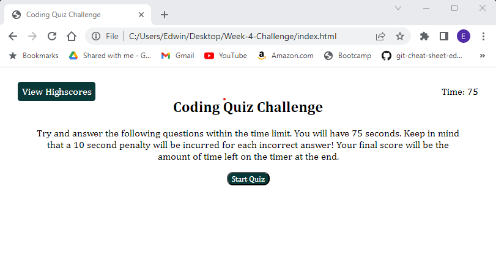
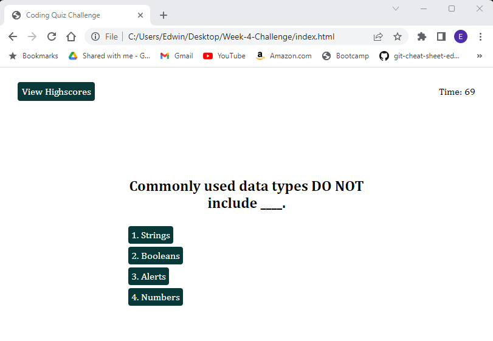
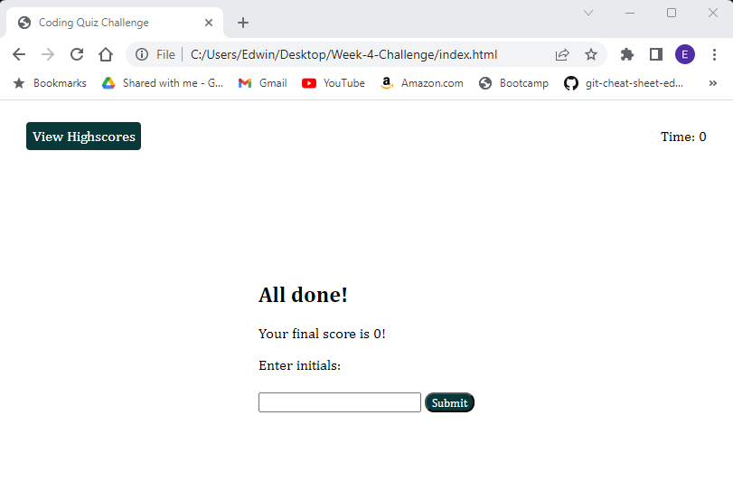
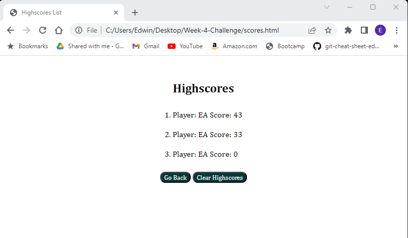

# Coding-Quiz-Challenge

## Description

I built this project for the purpose of practicing creating/manipulating elements in the DOM via JavaScript. This project is focused primarily on the following:
Creating elements in the DOM via JavaScript.
Appending elements to divs once created via JavaScript.
Using Event Listeners to run functions when events occur.
Hiding/Displaying content based on events using event listeners.
Local Storage

This project can be found here: 

https://edwinalban.github.io/Coding-Quiz-Challenge/index.html

## Installation

N/A

## Usage

The project can be used to practice traversing the DOM, selecting elements in the DOM for manipulation, adding Event Listeners (specifically "click" events), running functions as a result of user clicks, displaying content sequentially while removing previous content from the viewport, setting strings to local storage and retrieving them as objects to be displayed in the viewport.

